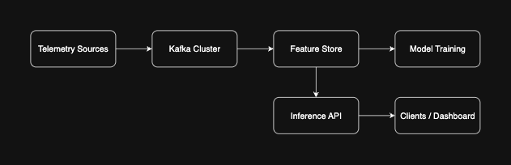

# High-Level Architecture

Below is the end-to-end flow of our F1 Strategy Optimization Platform:

**Flow:**  
1. **Telemetry Sources** → real-time car/track data  
2. **Kafka Cluster** → streaming ingestion  
3. **Feature Store** → online/offline feature materialization  
4. **Model Training** → scheduled retraining and hyperparameter tuning  
5. **Inference API** → real-time `/predict` endpoint  
6. **Clients / Dashboard** → strategy engineers & race ops users